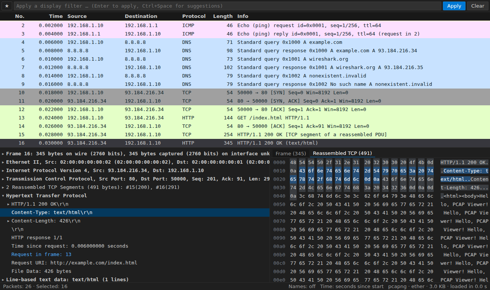
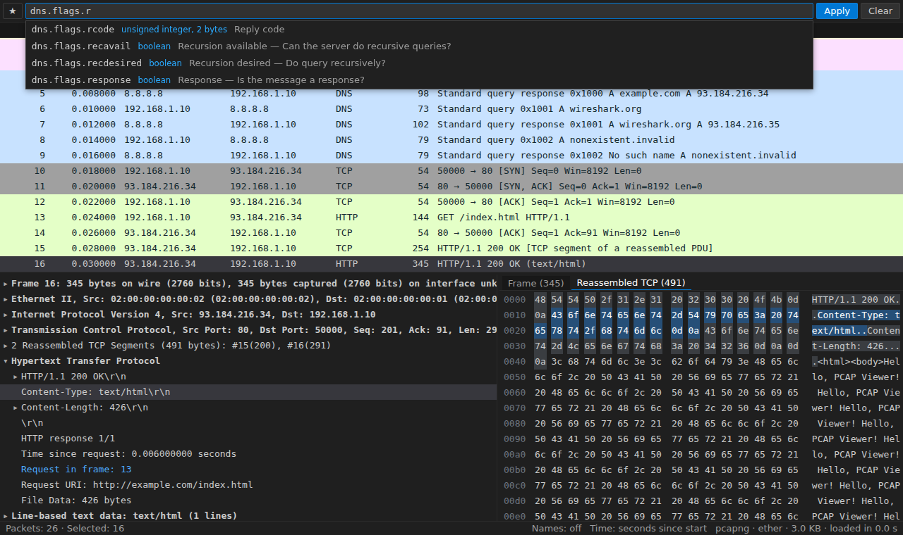
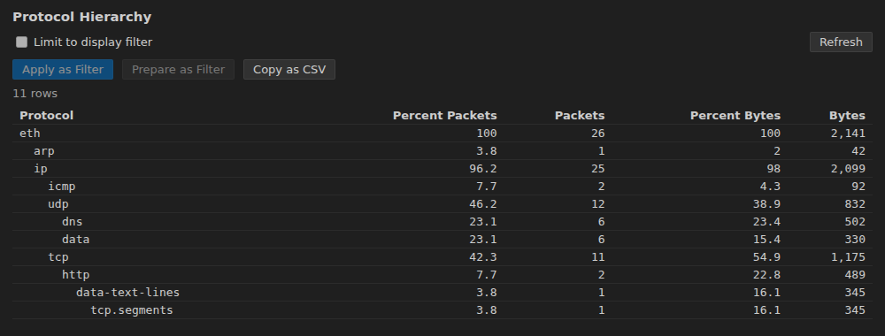

# PCAP Viewer for VS Code

Open `.pcap` / `.pcapng` captures in VS Code with a Wireshark-like packet list,
protocol tree and hex view. **tshark** (Wireshark's command-line tool) does all
dissection and filtering, so results match Wireshark exactly.



## Getting started

1. Install **PCAP Viewer** from the VS Code Marketplace or Open VSX, or
   download the `.vsix` from
   [GitHub releases](https://github.com/DenPaz/vsc_pcap_viewer/releases) and
   run `code --install-extension pcap-viewer-<version>.vsix`.
2. Install the [requirements](#requirements): **tshark** and **Python 3.14+**.
3. Run **PCAP: Get Started** (also under _Help › Welcome_). The walkthrough
   checks both tools, says how to install what's missing and opens a sample
   capture.

Then open any capture file. Every command is in the Command Palette (`PCAP: …`)
and in the viewer's **☰** menu at the end of the filter bar, grouped under
headings that unfold on click (or `→`); typing searches them all.

### Requirements

- **tshark** 4.x, from Wireshark: [wireshark.org](https://www.wireshark.org/download.html),
  `apt install tshark`, `brew install wireshark` or `choco install wireshark`.
  Found on `PATH` or in the default install locations, else set
  `pcapViewer.tsharkPath`. Older 3.x releases work too.
- **Python 3.14+** on `PATH` (`python3.14`, `python3`, `python`, `py -3`), or
  set `pcapViewer.pythonPath`. The backend uses only the standard library:
  nothing to `pip install`.

### Supported files

tshark recognises the format from the content; the file name only decides
which editor VS Code offers.

- **Open in the viewer**: `.pcap`, `.pcapng`, `.cap`, `.ntar`, the same
  compressed (`.gz`, `.zst`, `.lz4`), `tcpdump -C` pieces (`.pcap0`,
  `.pcap1`, …), `.snoop`, `.erf`, `.pklg`, `.btsnoop`.
- **Offered in _Reopen Editor With…_ only**: `*.[0-9]`, `.log`, `.dmp`,
  `.trc`, `.ber` (generic names that are sometimes captures).

**Any other name**, or no extension at all: right-click the file in the
Explorer, or run _PCAP: Open File in PCAP Viewer…_ and pick it. It opens if
tshark reads it (Network Monitor, Sniffer, a raw BER/ASN.1 value…), else you
are told why. A file of several BER records back to back isn't readable:
tshark reads one BER value per file. zstd and LZ4 need a tshark built with
them (`tshark --version`).

## Features

### Packet list and details

- **Millions of packets** scroll smoothly: only visible rows are drawn, pages
  come from a cached index, and scrolling never re-runs tshark.
- **Fast opening**: the first packets show within half a second while the rest
  is indexed (progress bar and status bar). The index is saved, so reopening an
  unchanged capture is instant; closing mid-way keeps the progress for next time.
- **Protocol tree and hex view** with two-way highlighting, reassembled data
  included. Right-click a field to apply or prepare it as a filter, colorize,
  add it as a column or copy it.
- **Quick view of late packets**: from packet 20,000 on, details show in about
  0.3 s by dissecting only the 300 packets before it, until the exact view
  replaces it.
- **Columns**: sort by any column (addresses numerically, time by the format
  shown); add custom columns from any field; hide, rename, reorder and resize.
- **Multi-select** with `Shift`/`Ctrl`+click, `Shift`+arrows and `Ctrl+A`; mark,
  copy or export the selection.
- **Coloring rules** like Wireshark's (default set included, first match wins),
  with an editor (_PCAP: Edit Coloring Rules_) and _Colorize with Filter…_.
- **Packet comments** in pcapng files: shown on the row and above the details;
  edit with `Ctrl+Alt+C`, undo with `Ctrl+Z`, save into the file with `Ctrl+S`.
- **Name resolution** for MAC addresses, IP addresses (from the capture's DNS
  answers and hosts files) and ports: _PCAP: Name Resolution…_. Nothing is
  looked up on the network unless you allow it.
- **Time formats** (relative, deltas, absolute, UTC, epoch) and a time
  reference (`Ctrl+T`).

### Display filters

- Wireshark syntax, **validated as you type**; invalid filters are never applied.
- **Autocomplete** from tshark's field list, including your Lua dissectors'
  fields: `Tab` takes the first suggestion.
- **Streaming**: on big captures matches show as they are found; ■ stops and
  keeps them. Finished results are cached with the index.
- **Saved and recent filters** (★), and **filter buttons** under the filter
  bar for one-click filters (**+** adds one; right-click to edit).

  

### Navigation

- **Find Packet** (`Ctrl+F`) by display filter, string or hex bytes.
- **Frame links** in the tree (_Request in frame_, _ACK of frame_…) with
  back/forward history (`Alt+Left`/`Alt+Right`).
- Next/previous packet in the conversation, first/last, go to packet, and
  **marks** (`Ctrl+M`) with next/previous marked.

### Statistics and graphs

Each report opens in a panel beside the capture, can be limited to the current
filter, and its rows apply or prepare the matching display filter.

- Conversations, Endpoints, Protocol Hierarchy, I/O Graph, Expert Information,
  Capture File Properties.
- HTTP (status codes, requests by host, load by server), DNS, packet lengths
  and service response times (ICMP, SMB, LDAP, SNMP, Diameter, GTP…).
- **Flow graph** of the displayed packets, and **TCP stream graphs** (Stevens,
  throughput, round-trip time, window).
- **VoIP calls**: SIP calls with their call flow, RTP streams with loss and
  jitter, per-packet stream analysis, and G.711 audio to play or save as WAV.
- **Follow TCP / UDP / TLS / HTTP stream** as ASCII, hex dump or raw.

  

### Capture, edit, export, import

- **Live capture** (_PCAP: Start Capture…_) on one or more interfaces with a
  capture filter; the list fills as packets arrive. Needs
  [permission to capture](#live-capture).
- **Capture editing** (_PCAP: Edit Capture…_): time shift, remove duplicates,
  keep a range, truncate, split, embed TLS keys. The result is a new capture.
- **Export** packets (displayed, all, selected or marked) to pcapng/pcap, the
  packet list to CSV/JSON, packet bytes, and full dissections as text, PDML or
  JSON.
- **Export Objects**: files carried over HTTP, SMB, TFTP, IMF, DICOM and
  FTP-DATA.
- **Merge captures**, with an offer to merge a rotated capture's pieces.
- **Import from Hex Dump** (text2pcap) from the editor, the clipboard or a file.

New captures stay unsaved until `Ctrl+S`. Exports never leave a partial file
and never overwrite the open capture.

### Dissection

- **TLS decryption** with an `SSLKEYLOGFILE` key log (_PCAP: Set TLS Key Log
  File…_); the viewer offers a reload when the file gets new keys.
- **Lua dissectors**: _PCAP: New Lua Dissector_ scaffolds one, _PCAP: Reload
  Dissectors_ checks it and links errors to their line (see
  `backend/dissectors/example.lua`). _PCAP: Lua Dissectors…_ (or the status
  bar's _Lua_ link) picks which scripts each capture loads; the choice is
  remembered per file. A Lua dissector registered on `wtap_encap` 90 decodes
  whole BER files: `DissectorTable.get("wtap_encap"):add(90, proto)`.
- **Decode As** rules and tshark **preference overrides**, per workspace folder.
- **Wireshark plugins** (dissectors in C): installed once for tshark, used by
  the viewer too; see [Wireshark plugins](#wireshark-plugins).

### AI help (optional)

Through VS Code's Language Model API (GitHub Copilot). Everything that sends
capture data asks first; see [Security](#security) for exactly what is sent.

- **Filter suggestions**: ✨ in the filter bar or `@pcap` in chat. Suggestions
  are checked with tshark; no packet data is sent.
- **Explain packets**: right-click _Ask Copilot About This Packet…_ or
  `@pcap /explain 12 15-17`.
- **Summaries and anomalies**: `@pcap /summary`, and _Ask Copilot_ in the Expert
  Information and TCP Stream Graph panels (`@pcap /anomaly`).
- **Questions with tools**: `@pcap how many DNS queries got no answer?` counts
  and looks things up read-only in the open capture.

## Keyboard shortcuts

On macOS use `Cmd` for `Ctrl`. They apply while a capture is the active editor.

| Key                            | Action                                 |
| ------------------------------ | -------------------------------------- |
| `Ctrl+/`                       | Apply display filter                   |
| `Ctrl+F`, `F3`, `Shift+F3`     | Find packet, next, previous            |
| `Ctrl+G`                       | Go to packet                           |
| `Alt+Left`, `Alt+Right`        | Back / forward through jumps           |
| `Ctrl+.`, `Ctrl+,`             | Next / previous packet in conversation |
| `Ctrl+Home`, `Ctrl+End`        | First / last packet                    |
| `Ctrl+A`                       | Select all displayed packets           |
| `Ctrl+M`                       | Mark / unmark selected packets         |
| `Ctrl+Shift+N`, `Ctrl+Shift+B` | Next / previous marked packet          |
| `Ctrl+T`                       | Set / unset time reference             |
| `Ctrl+Alt+C`                   | Add or edit packet comment             |
| `Enter` / `→` in the list      | Move to the protocol tree              |
| `Esc`                          | Restore the filter, close the find bar |

## Settings

All settings start with `pcapViewer.`. Those marked † can differ per workspace
folder; those marked ‡ can only be set in user settings.

| Setting                                                                     | What it does                                                                |
| --------------------------------------------------------------------------- | --------------------------------------------------------------------------- |
| `tsharkPath`, `pythonPath`                                                  | Tools to use (empty: auto-detect)                                           |
| `luaScripts`†, `dissectorsFolder`†                                          | Lua dissectors to load                                                      |
| `decodeAs`†, `prefs`†                                                       | Decode As rules (`"tcp.port==8080,http"`) and preference overrides          |
| `tlsKeyLogFile`†                                                            | TLS key log for decryption                                                  |
| `columns`†, `columnLayout`                                                  | Custom columns; column order and hidden columns                             |
| `timeFormat`                                                                | `relative`, `delta_displayed`, `delta_captured`, `absolute`, `utc`, `epoch` |
| `savedFilters`, `filterButtons`                                             | Named filters and filter buttons (user or workspace)                        |
| `coloringRules`, `colorize`                                                 | Coloring rules (first match wins) and coloring on/off                       |
| `nameResolution.mac` / `.network` / `.capturedDns` / `.transport`           | Which names to show                                                         |
| `nameResolution.external`‡                                                  | Also ask your DNS server (off)                                              |
| `capture.stopAfterPackets` / `Seconds` / `Megabytes`, `capture.promiscuous` | Live capture limits and mode                                                |
| `indexCache.enabled`, `indexCache.maxSizeMB`                                | Saved indexes (on, 1 GB)                                                    |
| `quickDetail.after`, `quickDetail.window`                                   | Quick view from packet 20,000, of 300 packets (`0`: never)                  |
| `maxCachedFrames`, `requestTimeoutSeconds`                                  | Backend cache budget; timeout of quick requests                             |
| `ai.enabled`                                                                | Offer AI help when a model is available (on)                                |
| `ai.allowPacketData`‡, `ai.allowCaptureStatistics`‡, `ai.allowPacketBytes`‡ | What AI features may send (off; asked once)                                 |

## Live capture

Capturing runs Wireshark's `dumpcap`, which needs permission:

- **Linux**: `sudo dpkg-reconfigure wireshark-common` (answer _Yes_), then
  `sudo usermod -aG wireshark $USER` and log in again; elsewhere
  `sudo setcap cap_net_raw,cap_net_admin=eip $(command -v dumpcap)`.
- **macOS**: install ChmodBPF (in Wireshark's disk image, or
  `brew install --cask wireshark-chmodbpf`), then log in again.
- **Windows**: install [Npcap](https://npcap.com) (included with Wireshark).

Unsaved captures live in the extension's storage and are removed after 7 days
if left behind.

## Wireshark plugins

Dissectors written in C can be built as Wireshark plugins (a `.so` file, `.dll`
on Windows). tshark loads them, so the viewer does too, with nothing to
configure:

1. Get the plugin built for your Wireshark's version: Wireshark 4.6.x (see
   `tshark --version`) only loads plugins built for 4.6.
2. Run _PCAP: Show TShark Plugins_ and choose _Open Personal Plugin Folder_
   (`~/.local/lib/wireshark/plugins/4.6/epan` on Linux and macOS,
   `%APPDATA%\Wireshark\plugins\4.6\epan` on Windows; it is created if
   missing). Copy the plugin there.
3. Reopen the capture or run _PCAP: Reload Capture_. _PCAP: Show TShark
   Plugins_ now lists it under _Your plugins_; its fields work in filters,
   columns and autocomplete, and saved indexes are rebuilt with it.

A plugin's port preferences go into `pcapViewer.prefs`, and _PCAP: Decode As…_
moves its dissectors to other ports. Wireshark ignores personal plugins when it
runs as root. In a remote window, install the plugin on the remote machine,
where tshark runs. Lua dissectors need none of this (see
[Dissection](#dissection)).

## Remote windows

In a remote window (WSL, SSH, Dev Containers, Codespaces) the extension, Python,
tshark and live captures all run **on the remote machine**, so install the
tools there and set `pythonPath`/`tsharkPath` in the Remote settings. A Dev
Container example:

```jsonc
{
  "image": "mcr.microsoft.com/devcontainers/python:3.14",
  "postCreateCommand": "sudo apt-get update && sudo DEBIAN_FRONTEND=noninteractive apt-get install -y tshark",
  "customizations": { "vscode": { "extensions": ["denpaz.pcap-viewer"] } },
  // Only for live capture:
  // "runArgs": ["--cap-add=NET_RAW", "--cap-add=NET_ADMIN"],
  // "postStartCommand": "sudo setcap cap_net_raw,cap_net_admin=eip /usr/bin/dumpcap"
}
```

Captures that aren't files on disk (Live Share, archives) open as a copy. In
**Restricted Mode** the tool paths and Lua dissectors come from user settings
only, so an untrusted repository can't run its own programs.

## Troubleshooting

| Symptom                                                         | Fix                                                                                                                                                                                                                        |
| --------------------------------------------------------------- | -------------------------------------------------------------------------------------------------------------------------------------------------------------------------------------------------------------------------- |
| "No Python 3.14+ interpreter found"                             | Set `pcapViewer.pythonPath` (e.g. to `uv python find 3.14`), or start VS Code from a terminal where `python3.14` works.                                                                                                    |
| "tshark was not found"                                          | Install tshark or set `pcapViewer.tsharkPath`.                                                                                                                                                                             |
| "You don't have permission to read the file" (yours)            | Ubuntu's AppArmor profile for tshark allows only `/tmp`. Add `owner @{HOME}/** rw,` to `/etc/apparmor.d/local/tshark`, then `sudo apparmor_parser -r /etc/apparmor.d/tshark`. Snap tshark: use the distribution's package. |
| Stopping a filter is slow; the log says "could not stop tshark" | The same profile blocks signals. Add `signal (receive) peer=unconfined,` and `signal (receive) peer=vscode,` to the same file and reload it.                                                                               |
| A Lua dissector isn't applied                                   | Check _PCAP: Show Log_. tshark disables Lua as root. _PCAP: Reload Dissectors_ after editing.                                                                                                                              |
| A Wireshark plugin's protocols are missing                      | _PCAP: Show TShark Plugins_: a plugin that isn't listed was built for another Wireshark version or is in the wrong folder (_Open Personal Plugin Folder_). Not as root.                                                    |
| TLS stays encrypted                                             | The key log must contain the capture's sessions: set `SSLKEYLOGFILE` before capturing and don't clear the file.                                                                                                            |
| Opening a huge file is slow                                     | That is tshark's speed. `"pcapViewer.prefs": { "tcp.analyze_sequence_numbers": false }` makes it cheaper.                                                                                                                  |
| The first capture after installing Wireshark takes long to open | macOS checks Wireshark.app the first time tshark runs, which can take a minute; later opens are fast. _PCAP: Show Log_ shows how long each step took.                                                                      |

_PCAP: Show Log_ shows backend and tshark messages.

## Security

- tshark and Python run with argument arrays, never through a shell.
- Packet contents are untrusted: the webview inserts them only as text, under
  a strict Content-Security-Policy with a per-load nonce, and can only call an
  allow-list of backend methods.
- CSV exports prefix cells that look like formulas with `'`.
- **AI requests** go through VS Code's Language Model API, so VS Code asks for
  consent and your Copilot policies apply. `"pcapViewer.ai.enabled": false`
  turns it all off. The `allow*` settings are user-only, so a workspace can't
  enable them, and prompts tell the model the data is untrusted.

| Feature                                      | What is sent                                                                                                                              | Needs                    |
| -------------------------------------------- | ----------------------------------------------------------------------------------------------------------------------------------------- | ------------------------ |
| Filter help (✨, _Suggest Display Filter…_)  | Your description, the current filter, protocol names in the capture, matching field names and descriptions                                | `ai.enabled`             |
| _Ask Copilot About This Packet…_, `/explain` | Up to 8 packets: row and dissection tree (250 lines each), your question, the filter; bytes only with `allowPacketBytes` (256 per packet) | `allowPacketData`        |
| _Summarize Capture_, `/summary`              | Capture properties, protocol hierarchy (40 rows), top 15 conversations and endpoints, expert counts, traffic in 12 buckets                | `allowCaptureStatistics` |
| Expert _Ask Copilot…_, `/anomaly`            | Up to 10 expert entries (5 packet numbers each) and up to 5 conversation rows                                                             | `allowCaptureStatistics` |
| TCP Stream Graph _Ask Copilot_, `/anomaly`   | Endpoints, derived facts (bytes, retransmissions, RTT, zero windows), up to 200 packets as numbers and flags                              | `allowCaptureStatistics` |
| `@pcap` tools: count, stats, capture info    | Filters and their counts, statistics tables (25 rows), capture properties                                                                 | `allowCaptureStatistics` |
| `@pcap` tool: field search                   | Field names and descriptions (nothing from the capture)                                                                                   | `ai.enabled`             |
| `@pcap` tool: list packets                   | Up to 20 packet-list rows for a filter                                                                                                    | `allowPacketData`        |

`allowPacketData` implies `allowCaptureStatistics`. Payload fields become
"[N bytes not sent]" unless `allowPacketBytes` is on.

## How it works

```
Webview (HTML/JS) --postMessage--> Extension host (TypeScript)
                                     | JSON-RPC over stdio
                                     v
                                   Python backend (stdlib only)
                                     | argv-only subprocesses
                                     v
                                   tshark, dumpcap, editcap, mergecap, text2pcap
```

- **Open**: one `tshark -T fields` pass writes the list columns to a file with
  an 8-byte-per-packet offset index, saved for the next open.
- **Filter**: one `tshark -Y` pass keeps the matching frame numbers (4 bytes
  each), cached and saved with the index.
- **Details**: `tshark -c N -Y frame.number==N -T pdml`, so tshark stops after
  the packet; the quick view dissects an `editcap` window instead.

Measured on 1,000,000 synthetic packets (146 MB, 4-core VM, tshark 4.2):

| Operation                      | Time                                                    |
| ------------------------------ | ------------------------------------------------------- |
| Open                           | 29–36 s; first colored rows after 0.5 s                 |
| Reopen (saved index)           | 0.01 s                                                  |
| Page of 200 rows, anywhere     | < 1 ms                                                  |
| Filter                         | 26 s; first matches after 0.5 s; cached filters instant |
| Sort by a column               | 0.6 s                                                   |
| Details of frame 1,000,000     | 20–26 s exact, 0.3 s quick view                         |
| Peak memory (backend / tshark) | 125 MB / 225 MB                                         |

Almost all of the time is tshark's dissection; `pcapViewer.prefs` can turn off
costly analyses.

## Contributing

See [CONTRIBUTING.md](CONTRIBUTING.md) for building, testing and releasing,
[CHANGELOG.md](CHANGELOG.md) for what changed in each version, and `CLAUDE.md`
for design notes. Possible next steps: configuration profiles and comparing
two captures.

## License and Wireshark

MIT licensed. **tshark is part of Wireshark, licensed under the GNU GPL v2.**
The extension doesn't bundle, link to or modify Wireshark: it runs the tshark
you installed as a separate process and reads its output.
